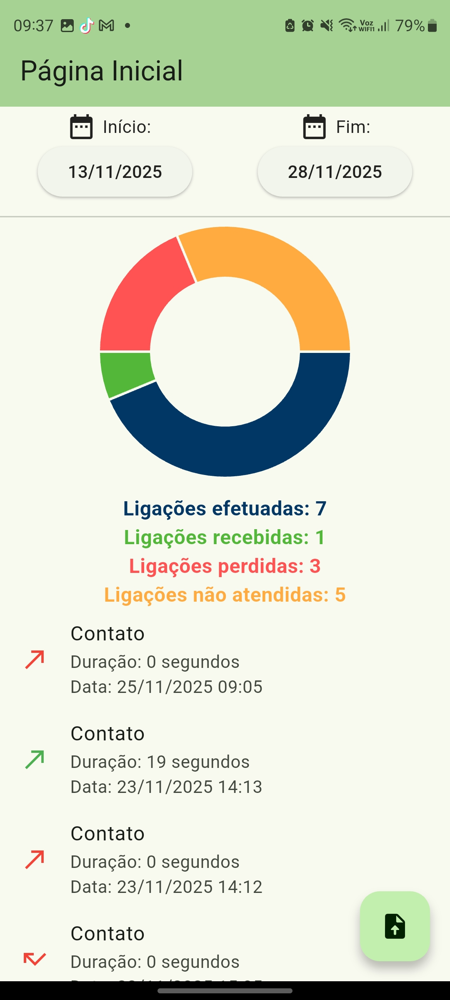
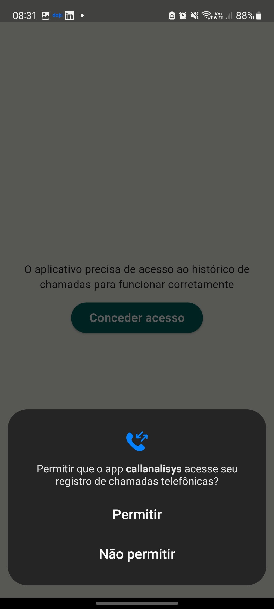
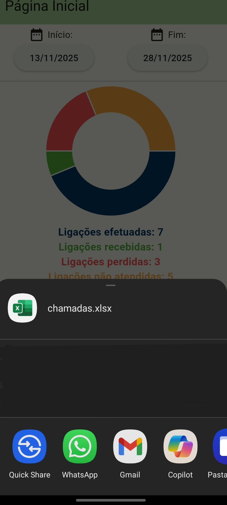

# Call Analisys

Call Analysis is a Flutter/Dart app designed specifically for Android. It validates the call history for quick analysis within the app, and it can also export the data to Excel for further analysis in other software, such as Excel or Google Sheets.

## Getting Started

When opened for the first time, the app will request permissions to access contacts and call logs.

**Attention:** Without these permissions, the app will not work.

By default, the app will already filter the current day, but the user can select any desired date range to view the call history.

Export button: The button at the bottom right exports the entire call history stored on the phone. After tapping it, a pop-up will open allowing the file to be shared through various apps or even saved to the cloud.

## Technologies
Framework:   
- Flutter

Dependencies:

- call_log: ^6.0.1

- permission_handler: ^12.0.1

- excel: ^4.0.6

- intl: ^0.20.2

- fl_chart: ^1.1.1

- share_plus: ^12.0.1

- path_provider: ^2.1.5

## Screenshoots
<!--  -->

